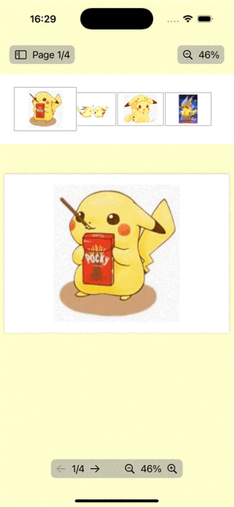

# Demo for using PDFKit with SwiftUI

## Generate New PDF
[Demo Code](./PDFEditor/NewPDFView.swift)

Related Blog: [SwiftUI: Create PDF 2 Ways](https://medium.com/@itsuki.enjoy/swiftui-create-pdf-2-ways-71ce1d2f02f5)

## Display PDF
Display PDF with PDFKit with
- current page number, total page count, and scale
- controls for paging and modifying scale from SwiftUI View
- Two way PDF Thumbnails (displaying a thumbnail PDFPage Contents as well as controlling which page is displayed)

[Demo Code](./PDFEditor/DisplayPDFView.swift)

Related Blog: [SwiftUI: Display PDF with PDFKit](https://medium.com/gitconnected/swiftui-display-pdf-with-pdfkit-864a4cc9a89e)

## Static Annotation

Add Static Annotations by
- using `PDFAnnotation` class
- creating custom subclass of `PDFAnnotation` for adding custom graphics

Add Page graphics such as watermark by
- subclassing `PDFPage`

[Demo Code](./PDFEditor/AnnotationView.swift)

Related Blog: [SwiftUI: Add Static Annotations & Page Graphics to PDF](https://medium.com/@itsuki.enjoy/swiftui-add-static-annotations-page-graphics-to-pdf-905f37af6a30)

## Interactive Form Elements

Add Interactive Form Elements (Widget annotation) to PDF
- TextField Input
- Button
- Choices

[Demo Code](./PDFEditor/WidgetView.swift)

Related Blog: [SwiftUI: Add Interactive Form Elements to PDF](https://levelup.gitconnected.com/swiftui-add-interactive-form-elements-to-pdf-579b555d680f)

## PDF Actions

Add `PDFActions` to PDF
- `PDFActionGoTo`
- `PDFActionURL`
- `PDFActionResetForm`
- `PDFActionNamed`

[Demo Code](./PDFEditor/PDFActionView.swift)

Related Blog: [SwiftUI: Adding PDF Actions with PDF Kit](https://medium.com/@itsuki.enjoy/swiftui-adding-pdf-actions-with-pdf-kit-34fd841cc484)

# Custom Drawing Annotation

Add/Edit/Erase custom drawing annotation to/from PDF.

Can be used for
- adding/editing custom mark ups
- adding signature field
to PDF.

[Demo Code](./PDFEditor/DrawingView.swift)

Related Blog: [SwiftUI: Add, Erase and Save Custom Drawing Annotations to PDF](https://medium.com/gitconnected/swiftui-add-erase-and-save-custom-drawing-annotations-to-pdf-6f971e717bb3)

